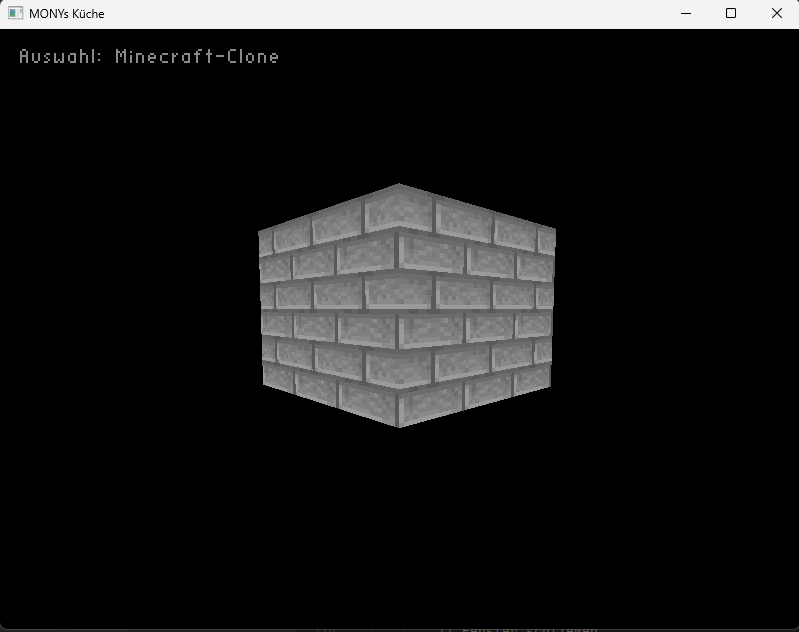
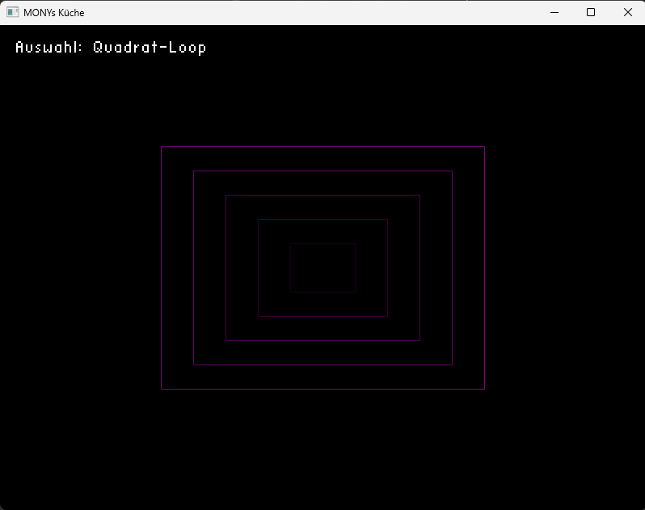
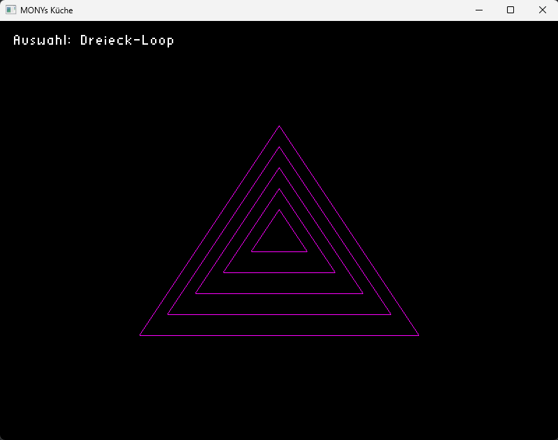

# 🎮  Learning OpenGL

<p align="center">
  
  
  
  
</p>

A personal Java learning project focused on OpenGL rendering, window management, and simple 3D scene experiments using LWJGL.

## ✨ Highlights

- 2D and 3D OpenGL rendering experiments
- Custom player movement and mouse-look camera controls
- Basic text rendering in the window
- World generation and block-based scene rendering
- Lightweight Gradle setup with LWJGL dependencies

# 📷 Showcase

<p align="center">
  
</p>

<p align="center">
  <b>🌍 Minecraft-like Block World</b><br>
  Procedurally generated 3D world with block-based rendering. (Still in progress)
</p>

<br>

<table align="center">
  <tr>
    <td align="center">
      
      <br>
      <b>⬛ Square Loop</b>
    </td>
    <td align="center">
      
      <br>
      <b>🔺 Triangle Loop</b>
    </td>
  </tr>
</table>


## 🧩 Project Overview

This repository is a hands-on learning project for exploring:

- GLFW window creation and event handling
- OpenGL pipeline basics
- Textures and 3D object drawing
- Camera movement and user input
- Small procedural world experiments

## 🏗️ Tech Stack

- Java
- Gradle
- LWJGL 3
- GLFW
- OpenGL

## 📁 Structure

```text
openGL/
├── src/
│   └── main/
│       └── java/
│           └── project/
│               ├── Main.java
│               ├── player.java
│               ├── helper/
│               │   ├── TextureLoader.java
│               │   ├── drawObjects.java
│               │   └── drawText.java
│               ├── settings/
│               │   └── renderingSettings.java
│               └── world/
│                   └── worldgeneration.java
├── build.gradle
├── gradlew
├── gradlew.bat
├── settings.gradle
└── .gitignore
```

## 🚀 Getting Started

### Prerequisites

- Java JDK 17 or newer
- Gradle wrapper included in the repo
- Windows runtime libraries are configured in Gradle for this project

### Run the project

1. Clone the repository:

```bash
git clone https://github.com/MONYtry/openGL.git
cd openGL
```

2. Build the project:

```bash
./gradlew build
```

3. Run the main class from your IDE (for example IntelliJ IDEA / VS Code Java extension):

- Main class: `project.Main`

> The project currently uses a direct Java application entry point and is intended to be launched from an IDE or via a custom Gradle run configuration.

## 🎮 Controls

- `W`, `A`, `S`, `D` — move
- `Mouse` — look around
- `Space` — jump
- `Shift` — sprint
- `Esc` — switch rendering modes / close interaction loop

## 🧠 Current Features

The project includes multiple demo modes in `Main.java`, such as:

- square loop rendering
- triangle rendering
- triangle loop rendering
- simple Minecraft-like block world preview

## 📌 Notes

This is a learning project and is still evolving. The codebase focuses on experimenting with low-level graphics programming rather than production-ready architecture.

## 🛠️ License

No explicit license has been set for this repository yet.

---

<p align="center">
  <sub>Made with 💙 for learning OpenGL and Java graphics programming.</sub>
</p>
